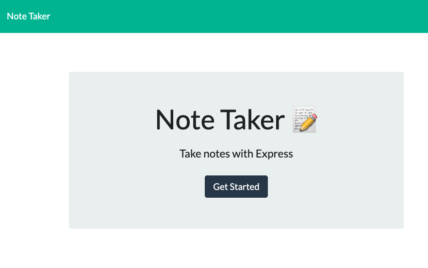
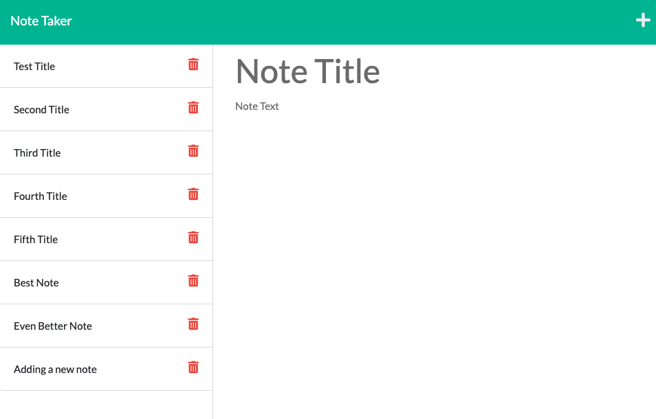

# note-taker

## [Application Url](https://noteawesome-taker.herokuapp.com/ )

## [GitHub Url](https://github.com/harry-100/note-taker)

## Description

This is an application  to take notes. You can write and save notes, delete notes that you don't need. It uses express.js  to connect client side and backend server. The application is deployed on heroku.

## Table of Contents

* [Usage](#Usage)
* [License](#License)
* [ScreenShots](#ScreenShots)
* [Questions](#Questions)

## Usage
This app can be used to create, save and delete notes. Its deployed on heroku . When you launch the app, you are presented with a landing page. Clicking on 'Get Started' button will take you to 'Notes' page which will list all the notes available. Click on any note title to see its content. To create a new note, click on plus sign. After inputting the note title and details, click on save button to save the note. Clicking on the red bin icon will delete the note. 

## License
This application is covered under [MIT](
      https://opensource.org/licenses/MIT
      ) license.

## ScreenShots

## Questions
If you need more information, please checkout my [github account](https://github.com/harry-100). You can also reach me via [email](mailto:harvinder.shah@gmail.com?subject=team-profile).